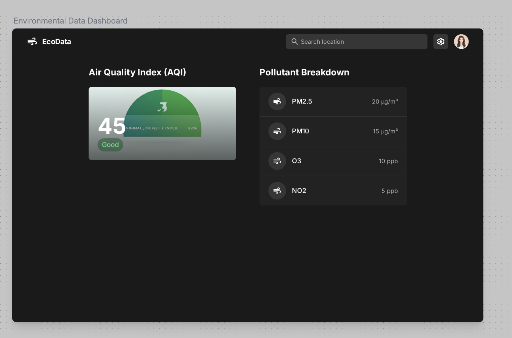

# Breathe Easy App
- Minimal Air Quality Checker
- Input country, location and get results instantly
- Includes history of inputs
- Error/loading handling
- Mobile/tablet responsive

## Vercel Link
[Live Demo](todo) <!-- Replace 'todo' with your actual Vercel deployment URL -->

## Getting Started

First, install dependencies:
```bash
npm install
```

Secondly, set up your env keys in `.env.local`, for example:
```bash
OPENWEATHER_API_KEY=<open-weather-api-key>
```

Lastly, run the development server:
```bash
npm run dev
# or
yarn dev
# or
pnpm dev
# or
bun dev
```

Open [http://localhost:3000](http://localhost:3000) with your browser to see the result.

## Features

- Search air quality by country and location
- View search history
- Responsive design for mobile and tablet
- Error and loading state handling

## UI Inspiration


Using Google Stitch for inspiration

## Tools

- [ShadCn](https://ui.shadcn.com/)
- [Next.js](https://nextjs.org/)
- [TailwindCSS](https://tailwindcss.com/)
- [Open Weather API](https://openweathermap.org/)

## Folder Structure

```
src/
  app/           # Next.js app directory
  components/    # Reusable UI components
  lib/           # Utility functions and API logic
  test/          # Unit and integration tests
  types/         # TypeScript type definitions
```

Check out the [Next.js deployment documentation](https://nextjs.org/docs/app/building-your-application/deploying) for more details.

## AI Assisted (VSCode Copilot on GPT-4.1)
- Google Stitch for design
- README documentation
- Git commit message suggestions
- Test case generation
- Accessibility improvements for input fields
- CSS enhancements and refactoring
- UI design inspiration
- Code reviews and refactoring suggestions


## Contributing
Contributions are welcome! Please open issues or submit pull requests.

## License
MIT
